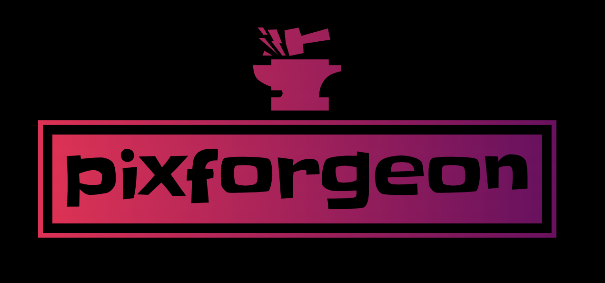
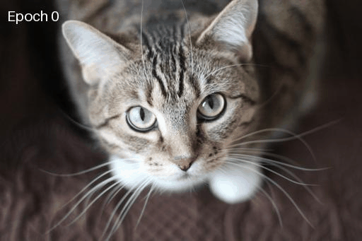

# About



**pixforgeon** is my experimental implementation of **Neural Style Transfer (NST)** using `TensorFlow`. `myvgg.py` was first developed following the guidelines of the original [**VGG19**](https://arxiv.org/pdf/1409.1556.pdf) implementation. Subsequently, the **NST** technique was utilized, blending the style of one image into the content of another, resulting in visually mesmerizing compositions.

## Table of Contents
  - [Synopsis](#synopsis)
  - [Personal Remarks](#personal-remarks)
  - [Repo Structure](#repo-structure)
  - [Roll it!](#roll-it)

## Synopsis
**NST** is an innovative technique that performs the following steps:

1. **Input Images:** Select a content image and a style reference image.

2. **Feature Extraction:** Employ a pre-trained neural network, **VGG19** in this case, to extract features from both the content and style images. This process involves selecting specific layers that capture meaningful information. Typically, the initial layers' activations capture basic or low-level features, whereas the activations in the final layers represent more complex or high-level features.

3. **Loss Calculation:** Calculate the loss function to measure the disparity between the generated/stylized image and both the content and style of the reference image. 

4. **Optimization:** Apply an optimization algorithm to minimize the overall loss by adjusting the pixel values of the generated image.

5. **Output Image:** The final output is a stylized image that combines the content of the chosen image with the artistic style of the reference image.

## Personal Remarks
My main sources of applying `step 3` was an exercise in a course offered by DeepLearning.AI in the Coursera platform instructed by Andrew Ng and  [this](https://www.tensorflow.org/tutorials/generative/style_transfer) tutorial by TensorFlow. 

Since that and because I noticed an inconsistency between the 2 implementations which is that in the latter, the loss function is not applied directly to the content image, I have checked numerous sources to understand the reason. It turns out that by following the latter approach, the style features can be more dominant and thus converge (generate) a style on the generated image faster. On the other hand though, content distotrions will appear faster.

By applying the second technique and experimenting with different images on actual faces, I noticed that the style sometimes can take over quite fast (approx. 400 epochs. This number was set as default if no epochs are specified) and generates some satisfying results, while other times for epochs > 2000 and a learning rate of 0.01, the style distorts the image, leading to either fascinating or funny outcomes.

## Repo Structure
```
pixforgeon/
├── README.md
├── images/
│   ├── logo.png
│   ├── content_images/
│   ├── style_images/
├── myvgg.py
├── output_images/
├── pixforgeon.py
├── pretrained_model/
│   └──vgg19_weights_tf_dim_ordering_tf_kernels_notop.h5 
├── requirements.txt
└── utils.py
```

## Roll it!


